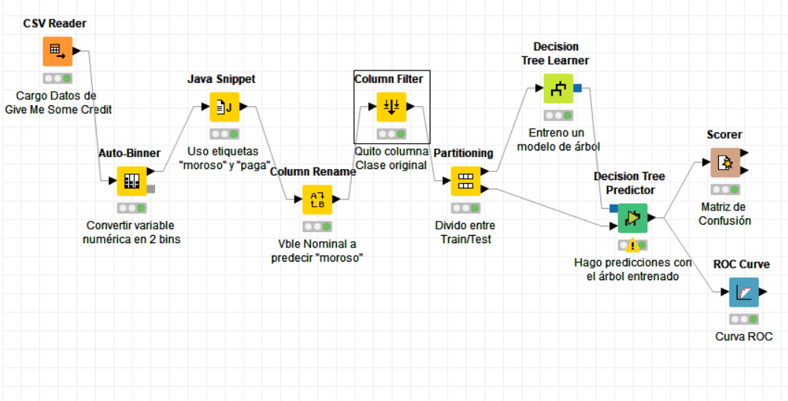
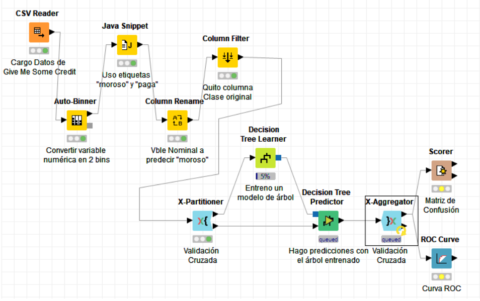
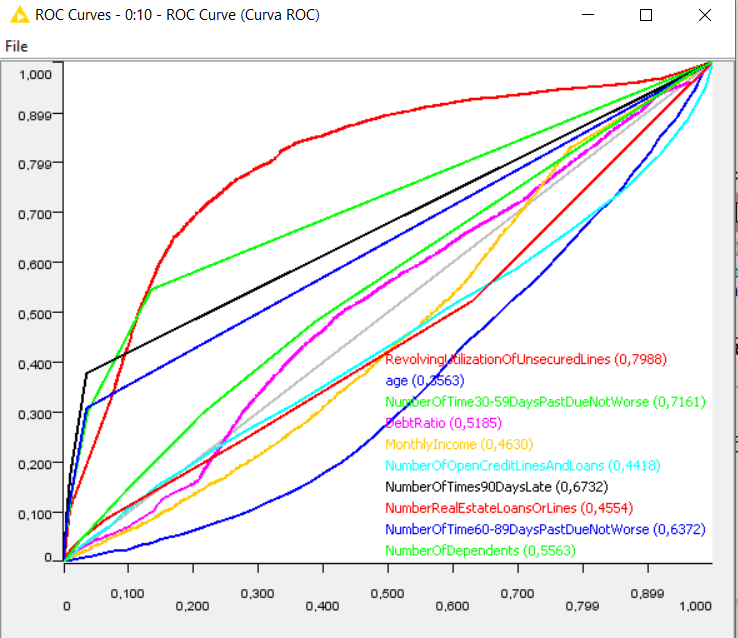
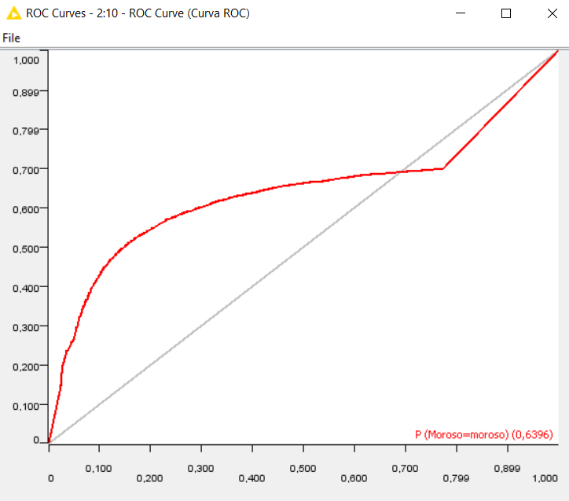

## Give Me Some Credit Example

Credit scoring in Knime using Give Me Some Credit data set. 
See https://www.kaggle.com/c/GiveMeSomeCredit 

### Simple Model Training Workflow

### Cross Validation Workflow

### Model Evaluation

- ROC Curve for each feature

- ROC Curve after cross validation

